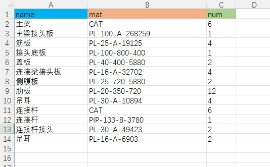

# 重量统计项目

本项目基于你提供的原始 Python 代码，构建了一个前后端分离的项目：
- 前端：提供了一个 HTML 页面上传 Excel 文件（需命名为 data.xlsx 格式）。
- 后端：使用 Flask 封装了原始代码逻辑，接受文件上传、计算并输出 `result_data.xlsx` 文件。
- 部署：仓库托管在 GitHub，并通过 Vercel 部署到线上。

## 部署步骤

1. 将整个项目 push 到 GitHub 仓库中。
2. 登录 [Vercel](https://vercel.com/) 并新建项目，从 GitHub 关联该仓库。
3. Vercel 会自动检测 `vercel.json` 配置，使用 `@vercel/python` 构建后端 API，且静态托管 `frontend` 目录下的前端页面。
4. 部署完成后，访问域名即可使用。

## 使用方法

- 打开主页，会显示上传 Excel 文件的表单。
- 上传文件后，后端读取文件（保存为 `data.xlsx`），运行原始代码逻辑计算重量，并返回生成的 `result_data.xlsx` 作为下载文件。

## data.xlsx文件格式

|name|mat|num|
|:-:|:-:|:-:|
|构件名称|CAT|每个设备包含数量|
|材料名称|材料规格|数量|

也就是说，在同一列中同时存在分类名称以及分类下的明细，依靠mat判断，mat为CAT的即为分类名称，其后面的明细都是这个分类下的，直到遇到下一个分类名称。

num栏也是根据这一行的属性来判断是明细的数量还是总的构件的数量。

输入样例：

## 输出样例图

## mat定义规则

**★板材**

PL-板厚-长-宽

例：PL-20-200-200，表示厚度20mm，长200mm，宽200mm的矩形板材

PL-板厚-D-直径

例：PL-20-D-200,表示厚度20mm，直径200mm的圆形板材。

PL-板厚-D-外径-d-内径

例：PL-20-D-200-d-50,表示厚度20mm，外径200mm，内径50mm的圆环板材。

PL-板厚-A-面积

例：PL-20-A-20000,表示厚度20mm，面积20000mm2的不规则形状板材。

**★管材**

PIP-管径-壁厚-长度

例：PIP-133-8-2000,表示管径133mm，壁厚8mm，长度2000mm的圆管。

**★槽钢**

CHAN-型号-长度

包括型号(字母小写)：
5, 6.3, 8, 10, 12.6, 14a, 14b, 16a, 16b, 18a, 18b, 20a, 20b, 22a, 22b, 25a, 25b, 25c, 28a, 28b, 28c, 32a, 32b, 32c, 36a, 36b, 36c, 40a, 40b, 40c

例：CHAN-16b-2000,表示型号为16b的槽钢，长度2000mm。

**★等边角钢**

L-边长-厚度-长度

例：L-50-5-1000，表示边长50mm厚度5mm长度1000mm的等边角钢。

**★不等边角钢**

LB-长边长-短边长-厚度-长度

例：LB-100-63-6-1000，表示长边100mm短边63mm厚度6mm长度1000mm的不等边角钢。

**★H型钢**

H-翼缘高-宽-腹板厚度-翼缘板厚-长度

例：H-300-300-10-15-2000，表示规格是H300x300x10x15长度2000mm的H型钢。

**★方管**

ST-边长-壁厚-长度

例：ST-100-10-2000，表示边长100mm壁厚10mm长度2000mm的方管。

**★扁方管**

FST-长边长-短边长-壁厚-长度

例：FST-120-60-6-1000，表示长边120mm短边60mm壁厚6mm长度1000mm的扁方管。

**★棒料**

ROD-直径-长度

例：ROD-40-2000，表示直径40mm长度2000mm的棒料。

**★预埋件用的螺纹钢**

LWG-直径-长度

例：LWG-28-550,表示直径28mm长度550mm的螺纹钢。

**★圆钢筋**

YG-直径-长度

例：YG-10-300,表示直径10mm长度300mm的圆钢筋。

**★钢丝网**

GSW-面积

例：GSW-30000,表示30000mm2的钢丝网。

